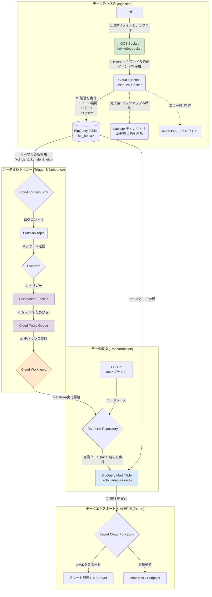

# KOL競馬データ処理・変換パイプライン on GCP

このリポジトリは、GCP上に構築された競馬データパイプラインの**データ変換（Transformation）**部分を担います。

GCSにアップロードされ、BigQueryの生テーブルに格納されたKOL競馬データをソースとして、**Dataform**を使い分析用のデータマート（`kolbi_analysis.race`）を構築します。

このリポジトリでは、主に以下の2点をコードで管理しています。
1.  **データ変換ロジック**: `dataform/`ディレクトリに格納された、`race`テーブルを生成するためのSQLXファイル。
2.  **インフラストラクチャ (IaC)**: `terraform/`ディレクトリに格納された、Dataformリポジトリや自動実行ワークフローを定義するTerraformコード。

**Note**: データ取り込み（Ingestion）部分（Cloud FunctionによるGCSからのデータロード）は、このリポジトリの管理範囲外です。

インフラの構築からデータ変換のロジックまで、すべてがコードとして管理されています。

## アーキテクチャ



1.  **データ取り込み**: ユーザーがKOLデータを含むZIPファイルをGCSにアップロードすると、Cloud Functionが起動し、BigQueryの`kolbi_keiba`データセットに生データを書き込みます。
2.  **データ変換トリガー (デバウンス機能付き)**: BigQueryのテーブル更新を検知すると、Eventarcが `Dispatcher Function` を呼び出します。Dispatcherは `Cloud Tasks` に「5分後にWorkflowsを実行するタスク」を作成します。**5分以内に連続して更新があった場合、新たなタスク作成は無視され（デバウンス）、最後の1回（厳密には最初の検知から5分後）だけWorkflowsが実行されます。**
3.  **データ変換**: Cloud WorkflowsはDataformのワークフローを開始します。Dataformは`kolbi_keiba`の生データを参照して、`kolbi_analysis.race`を含むプロジェクト内のすべてのテーブルを生成・更新します。
4.  **データエクスポート**: `export_schedules`, `export_races`, `export_race_uma_details` 等のCloud Functionsが、変換済みデータをFTPサーバーへCSVとしてアップロードし、同時にBubbleアプリのAPIエンドポイントへ更新通知（CSV URLの送信）を行います。

## 技術スタック

- **クラウド**: Google Cloud Platform
  - **コンピューティング**: Cloud Functions (第2世代), Cloud Workflows
  - **非同期処理**: Cloud Tasks (デバウンス用)
  - **ストレージ**: Cloud Storage (GCS)
  - **DWH**: BigQuery
  - **データ変換**: Dataform
  - **イベント**: Eventarc, Pub/Sub, Cloud Logging
  - **ID管理**: IAM, Secret Manager
- **IaC**: Terraform
- **バージョン管理**: GitHub
- **言語**: Python (Cloud Functions), SQL (Dataform), YAML (Cloud Workflows)

## 重要なテーブル定義

### `race.sqlx`
- KOLの出馬表データ(den1, sei1)を結合し、レースに関する情報を整形したマスターテーブル。
- 競馬場コードやトラックコードなどをJRA-VAN仕様に正規化。

### `race_uma.sqlx`
- 出走馬ごとの詳細データを統合した分析用ワイドテーブル。
- `kol_den2` (出馬表詳細), `kol_sei1`, `kol_sei2` (成績), `kol_ket` (血統) などを結合。
- **特徴的なロジック**:
  - `chokyo_awase_*`: 調教テキストから併せ馬の情報を正規表現で抽出。
  - `chokyo_awase_uma_race_code_kol`: 併せ馬の直近のレースIDを特定。
  - `chokyo_awase_uma_class`, `chokyo_awase_uma_kaku_kubun`: 併せ馬のクラスと、自身との格付け（格上/同格/格下）を判定。
  - `chokyo_awase_uma_kakuue_win_flag`: 格上の併せ馬に対して先着したかどうかをフラグ化。

## ディレクトリ構成

```
.
├── terraform/      # GCPインフラを定義するTerraformコード
│   ├── dataform.tf
│   ├── workflows.tf # Cloud Workflowsの定義
│   ├── triggers.tf  # Eventarc, Pub/Sub, Logging Sinkの定義
│   ├── dispatcher.tf # デバウンス用Dispatcher関数の定義
│   └── ...
├── functions/      # Cloud Functionsのソースコード
│   ├── dispatcher/ # Dataformトリガー用Dispatcher
│   └── ...
├── package.json
├── dataform.json
└── definitions/
    ├── sources/
    │   └── sources.js
    └── race.sqlx
```

## セットアップとデプロイ手順

### 1. 前提条件

- Google Cloud SDK (gcloud CLI) がインストール済みであること。
- Terraform がインストール済みであること。
- GCPプロジェクトで課金が有効になっていること。
- GitHubリポジトリ (`https://github.com/ENDoDo/kol-gcp-dataform`) への書き込み権限があること。

### 2. 環境設定

```bash
# GCPにログイン
gcloud auth login

# 使用するプロジェクトIDを設定
gcloud config set project smartkeiba

# アプリケーションのデフォルト認証情報を設定
gcloud auth application-default login
```

### 3. GitHub Personal Access Token (PAT) の設定

DataformがGitHubリポジトリにアクセスするために、認証用のトークンをSecret Managerに設定します。

1.  GitHubで、リポジトリ (`repo`) スコープを持つPersonal Access Token (Classic) を作成します。
2.  GCPコンソールでSecret Managerに移動し、`github-token` という名前のシークレットを作成します。
3.  作成したシークレットに、GitHubのPATをシークレットの値として追加します。

### 4. Bubble API / FTP 連携設定

以下のシークレットも同様にSecret Managerに設定する必要があります。

-   `kol_ftp_bubble_username`: FTPユーザー名
-   `kol_ftp_bubble_password`: FTPパスワード
-   `kol_bubble_workflow_api_key`: Bubble API Bearer Token

### 5. インフラのデプロイ

本プロジェクトでは Terraform Workspace を使用して環境（Staging / Production）を管理しています。

#### Staging環境

```bash
cd terraform

# ワークスペースの切り替え（作成がまだの場合は terraform workspace new stg）
terraform workspace select stg

# 初期化
terraform init

# デプロイ (stg.tfvarsを使用)
terraform apply -var-file="stg.tfvars"
```

#### Production環境

```bash
cd terraform

# ワークスペースの切り替え（作成がまだの場合は terraform workspace new prd）
terraform workspace select prd

# 初期化
terraform init

# デプロイ (prd.tfvarsを使用)
terraform apply -var-file="prd.tfvars"
```

`apply`が完了すると、環境に応じたGCSバケット、Cloud Function、Dataformリポジトリ、Cloud Workflowsなどが構築・更新されます。
特にDataform Workflowは、Staging環境では `dataform-trigger-workflow-stg`、Production環境では `dataform-trigger-workflow` がメインで使用されますが、Terraformの構成上、両方のリソース定義が含まれる場合があります。

## パイプラインの実行方法

1.  **データ取り込み**: KOLデータを含む`.zip`ファイルを、Terraformが作成したGCSバケット (`kol-keiba-bucket`) にアップロードします。Cloud Functionが自動で起動し、BigQueryの`kolbi_keiba`データセットにデータが格納されます。
2.  **データ変換**: BigQueryテーブルの更新が完了すると、**約5分間のデバウンス（待機・重複排除）期間**を経て、Dataformのワークフローが実行されます。これにより、複数のファイルがアップロードされた場合でも、ワークフローの実行は1回にまとめられます。

## クリーンアップ

作成したすべてのGCPリソースを削除するには、以下のコマンドを実行します。

```bash
cd terraform
terraform destroy
```