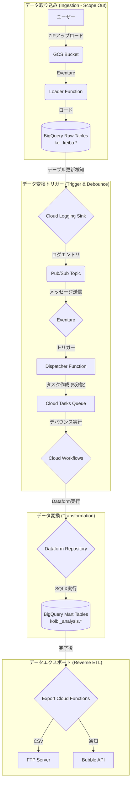
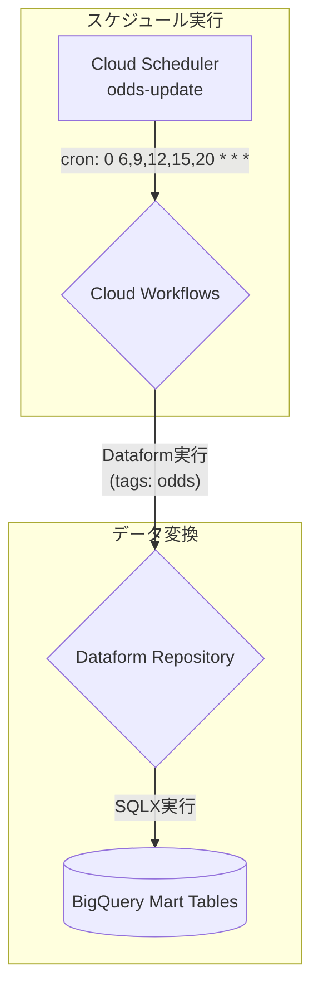

# KOL競馬データ処理・変換パイプライン on GCP

このリポジトリは、GCP上に構築された競馬データパイプラインの**データ変換（Transformation）**および**データエクスポート（Reverse ETL）**部分を担います。

GCSにアップロードされ、BigQueryの生テーブルに格納されたKOL競馬データをソースとして、**Dataform**を使い分析用のデータマートを構築し、外部システムへ連携します。

このリポジトリでは、主に以下の2点をコードで管理しています。
1.  **データ変換ロジック**: `definitions/`ディレクトリに格納された、Dataform SQLXファイル。
2.  **インフラストラクチャ (IaC)**: `terraform/`ディレクトリに格納された、GCPリソース定義。

**Note**: データ取り込み（Ingestion）部分（Cloud FunctionによるGCSからのデータロード）は、このリポジトリの管理範囲外です。

## アーキテクチャ

本パイプラインには、大きく分けて2つの実行トリガーが存在します。

### 1. ファイルアップロード・トリガー（データ更新時）

KOLから提供されるデータファイルが更新された際に実行されるフローです。



### 2. スケジュール・トリガー（リアルタイムオッズ更新）

オッズ情報など、時間経過とともに変化するデータを定期的に更新するフローです。



## 技術スタック

- **クラウド**: Google Cloud Platform
  - **コンピューティング**: Cloud Functions (Gen2), Cloud Workflows, Cloud Scheduler
  - **非同期処理**: Cloud Tasks
  - **DWH**: BigQuery
  - **データ変換**: Dataform
  - **イベント**: Eventarc, Pub/Sub, Cloud Logging
- **IaC**: Terraform
- **言語**: Python (Functions), SQLX (Dataform), YAML (Workflows)

## 重要なテーブル定義

`definitions/` 配下で定義されている主要なテーブルです。

### `race.sqlx`
- レース単位のマスターテーブル。
- 開催情報、コース条件、天候などを集約。

### `race_uma.sqlx`
- 出走馬ごとの詳細データを統合した分析用ワイドテーブル。
- 成績、過去走、血統、調教データを結合。
- **特徴的なロジック**:
  - **調教併せ馬判定**: パートナー馬の特定と、クラス格付け（格上/同格/格下）判定。


### `race_hit.sqlx`
- 的中判定・配当金テーブル。
- 単勝・複勝を除く券種の配当情報を保持。

### `race_kekka_keika.sqlx`
- レースの経過情報（コーナー通過順位など）を展開したテーブル。
- 1レースあたりの経過ポイント（角1〜角9）をレコードとして保持。

### `race_kekka_hassojokyo.sqlx`
- 発走状況（`hasso_jokyo1〜6`）をアンピボットして行展開したテーブル。

### `race_kekka_time.sqlx`
- ラップタイム・ペース・上り・通過タイムを保持するテーブル。
- KOLソース値は0.1秒単位整数のため `/10.0` で秒変換して格納。

### `race_kekka_haraimodoshi.sqlx`
- 払戻情報テーブル。券種ごとの払戻金・組み合わせを格納。

## ディレクトリ構成

```
.
├── definitions/        # Dataform SQLXファイル
│   ├── sources/        # データソースdeclarations
│   ├── race.sqlx
│   ├── race_uma.sqlx
│   └── ...
├── functions/          # Cloud Functions ソースコード
│   ├── dispatcher/     # Dataform起動用Dispatcher
│   ├── export_races/   # レース情報エクスポート → FTP + Bubble
│   ├── export_schedules/ # スケジュール情報エクスポート → FTP + Bubble
│   └── export_race_uma_detail_bubble/ # 馬詳細情報エクスポート → FTP + Bubble
├── terraform/          # GCPインフラ定義
│   ├── main.tf
│   ├── scheduler.tf    # Cloud Scheduler定義
│   ├── workflows.tf    # Cloud Workflows定義
│   └── ...
├── dataform.json       # Dataform設定
└── README.md
```

## セットアップとデプロイ手順

### 1. 前提条件
- Google Cloud SDK (gcloud CLI)
- Terraform
- GitHub Personal Access Token (PAT)

### 2. 環境設定
GitHub PATやBubble/FTPの認証情報は **Secret Manager** に以下の名前で登録する必要があります。
- `github-token`: Dataform用GitHub Token
- `kol_ftp_bubble_username`, `kol_ftp_bubble_password`: FTP認証
- `kol_bubble_workflow_api_key`: Bubble API Token

### 3. インフラのデプロイ (Terraform)

```bash
cd terraform

# Staging環境
terraform workspace select stg
terraform apply -var-file="stg.tfvars" -auto-approve

# Production環境
terraform workspace select prd
terraform apply -var-file="prd.tfvars" -auto-approve
```

## 運用時の注意点

- **自動デプロイ**: `main` ブランチへのマージ時、Dataformリポジトリは自動的に更新されますが、Terraformの変更（スケジューラや関数の設定変更）は手動で `apply` する必要があります。
- **デバウンス**: ファイルアップロード時のトリガーは、連続したアップロードをまとめて処理するため、最後のファイル検知から約5分後に処理が開始されます。

## Bubble API連携の制御

各エクスポート用 Cloud Function (`export_schedules`, `export_races`, `export_race_uma_detail_bubble`) による Bubble API への通知処理は、Terraform の変数 `enable_bubble_api` で制御可能です。

### 設定の切り替え

デプロイコマンドを共通化するため、有効・無効の切り替えは各環境の `tfvars` ファイル（`stg.tfvars`, `prd.tfvars`）の書き換えによって行います。

- **有効にする場合**: `enable_bubble_api = true` とするか、行自体を削除します（デフォルトが `true` のため）。
- **無効にする場合**: `enable_bubble_api = false` と記述します。

### デプロイコマンド (共通)

有効・無効に関わらず、常に以下のコマンドでデプロイを行います。

```bash
# Staging環境
terraform workspace select stg
terraform apply -var-file="stg.tfvars" -auto-approve

# Production環境
terraform workspace select prd
terraform apply -var-file="prd.tfvars" -auto-approve
```

### 内部仕様

1.  Terraform が `ENABLE_BUBBLE_API` という環境変数を Cloud Functions に渡します。
2.  Python コード内で `os.environ.get("ENABLE_BUBBLE_API")` を確認します。
3.  値が `false` の場合、API リクエストを送信せずに処理を完了し、その旨をログに出力します。

### 手動実行（ポータルからの強制再送）

kol-gcp-management ポータルの「Bubble連携」タブから、日付範囲を指定して手動で再送できます。`force_resend=true` を指定した場合は `ENABLE_BUBBLE_API` の値に関わらず FTP + Bubble の両方を実行し、SSE ストリームでリアルタイムの進捗を返します。詳細は [`docs/bubble-sync-cf-api.md`](docs/bubble-sync-cf-api.md) を参照してください。